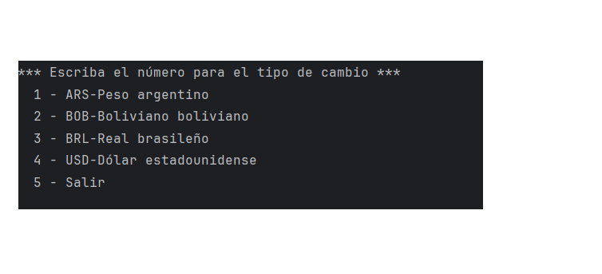
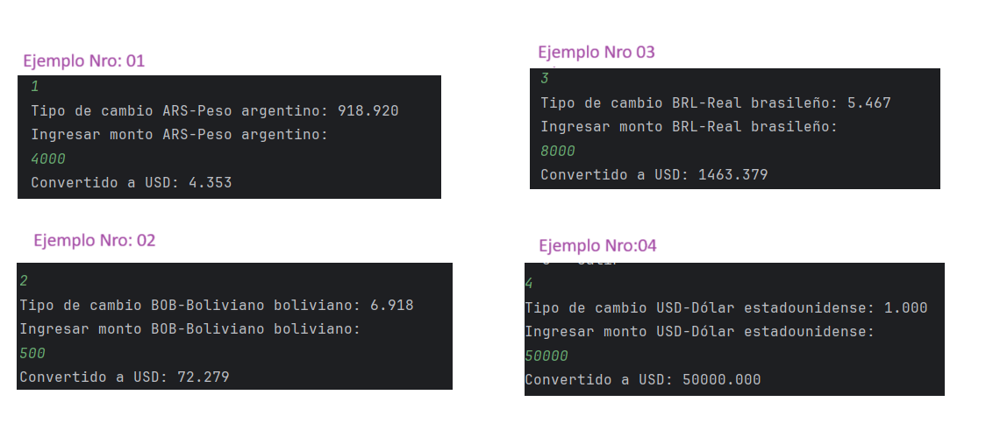

## Conversor de Monedas

Este proyecto es un conversor de monedas en Java que utiliza una API de tasas de cambio para realizar las conversiones.

# Funcionalidades:

- Convertir entre ARS, BOB, BRL y USD.
- Obtener las tasas de cambio más recientes desde una API(https://www.exchangerate-api.com/).
- Mostrar el resultado de la conversión con tres decimales de precisión.

# Herramientas:

- Java: Lenguaje de programación principal para el desarrollo del conversor de monedas.
- Git: Sistema de control de versiones utilizado para el seguimiento de cambios en tu código.
- GitHub: Plataforma de alojamiento de código que utilizaste para almacenar y compartir tu proyecto.
- Trello: Herramienta de gestión de proyectos utilizada para organizar y planificar el progreso del desarrollo.
- Postman: Utilizado para probar las API y asegurarte de que funcionen correctamente.
- IntelliJ IDEA: utilizado para escribir, editar y gestionar tu código Java y Markdown (para el README).

# Desarrollo:

# Menú Principal:

# Detalle del menú :

